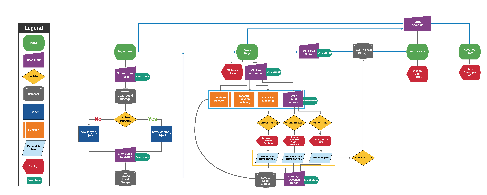

# Syntax Error Game

This is our class project for 201.

Authors: Ben Hill, Davee Sok, Taylor Thornton

## Project Description

Spot The Syntax Error is a web based application.  It can be used as a training resource for new and old coders to test their ability to locate syntax errors in blocks of code.  The aim of this application is to help coders train their eyes to identify syntax errors - beating linter to the punch!  Spot the Syntax Error is an online resource sure to strengthen skills and sharpen eyes.

## Problem Domain

The vision of this project is to provide a fun resource for new coders to practice spotting syntax errors. 
As new coders, the developers of this game want to provide additional resources for coders to strengthen their skills.
Scope In:

- Application will take in user name
- Create user object
- Generate random questions, display input field 
- Display status bar/score 
- Use local storage to store player score, correct/incorrect answers, date played, name

Scope Out: 
- This website will not require a password 
- This website will not take in user suggestions 

MVP:
- Take in user information from form 
- Create user object
- Display questions: 10 questions displayed out of bank of 30
- Display timer for each question
- Locally store user scores and name 
- Display correct answer score out of number of tries 

Stretch Goals: 
- Add medium and hard levels 
- Display all correct and incorrect answers with questions on result page 
- Leaderboard 

Functionality:
- User creates profile 
- User answers questions and can see their results 

Dataflow: 
- At homepage, user inputs information 
- Clicks button to start game 
- Question is displayed 
- User ID's syntax error and writes answer in input box 
- Results are shown on results page

## Wireframe

## Domain Model

Version: 1.0